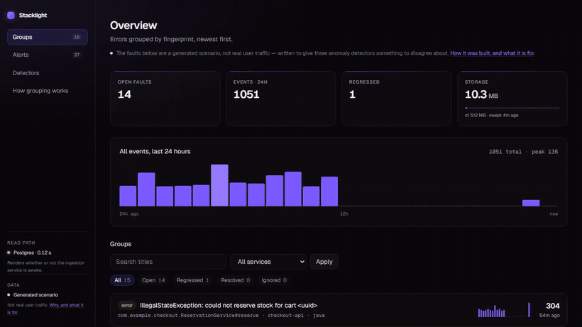
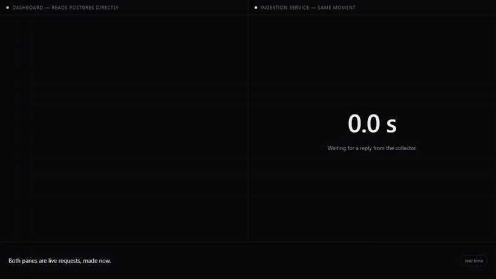
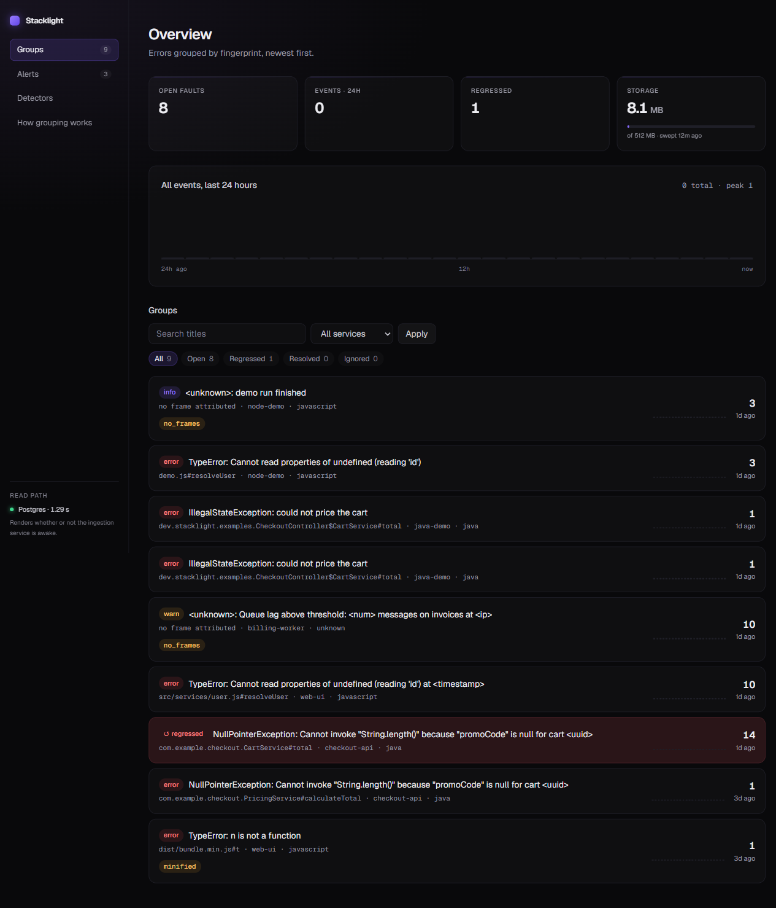
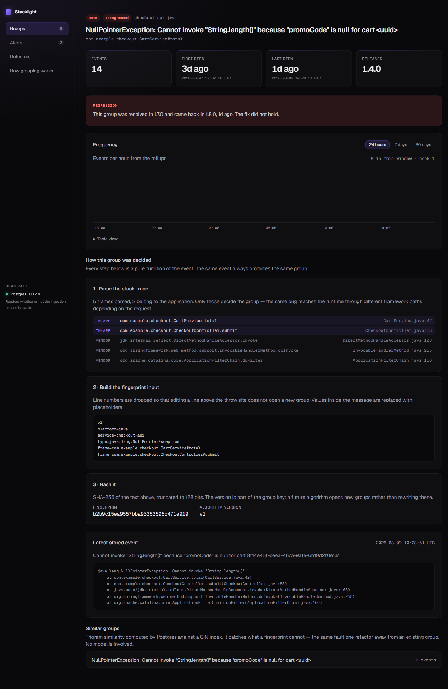

<div align="center">

# 🔦 Stacklight

**Error ingestion and triage for small services — the kind that run on a free
instance that falls asleep. Ten thousand events become a list of distinct faults,
each one explaining why it grouped where it did, and the dashboard that reads them
keeps working while the service that collects them is asleep.**

[](https://github.com/YusufKosarDev/stacklight/actions/workflows/ci.yml)
[](#tests-as-they-stand)
[](https://openjdk.org/projects/jdk/21/)
[](https://spring.io/projects/spring-boot)
[](https://nextjs.org/)
[](https://neon.tech/)
[](LICENSE)

🔗 **Live: [getstacklight.vercel.app](https://getstacklight.vercel.app)**
&nbsp;·&nbsp; no login, and it stays up when the collector does not

</div>

**Status: step 12.** Events are grouped into distinct faults, counted into an
hourly trend that outlives them, kept inside a storage budget that would
otherwise take the project down, watched by three detectors whose relative merits
are measured rather than assumed, delivered by clients written around a collector
that sleeps, read through an interface that ships no JavaScript of its own,
triaged from a console the ingestion service serves itself behind a second key,
and instrumented on the write path. Three checks guard the claim the rest of it
rests on, and one of them is a request made against the deployment rather than
against the repository.

| | |
|---|---|
|  |  |
| **What it is.** Faults, why each event grouped where it did, the scorecard that chose the active detector, and the alerts. ([webm](docs/media/tour.webm)) | **The bet, happening.** Both panes are live requests made at the same moment: the dashboard answers in **0.80 s**, the ingestion service takes **104.9 s** to wake. ([webm](docs/media/bet.webm)) |

The second clip is the one worth thirty seconds. It is not staged and it is not a
mock-up: the left pane is the deployed dashboard, the right is a real request to
the real collector, and the counter is timing it. The wait is played at seven
times speed with the speed on screen and the counter still reading true seconds —
a hundred seconds does not fit in a loop anybody watches, and cutting it out
silently would have made the clip an illustration rather than evidence.

---

## Contents

- [The architectural bet](#the-architectural-bet) — the read path never touches the ingestion service, and why that decides everything else
- [Grouping](#grouping) — ten thousand events are not ten thousand problems
- [Anomaly detection, and why the textbook answer does not fit](#anomaly-detection-and-why-the-textbook-answer-does-not-fit) — three detectors, shadow mode, and a scorecard that can disagree with the one in charge
  - [The three detectors](#the-three-detectors)
  - [Shadow mode](#shadow-mode)
  - [Self-scoring, and what it is not](#self-scoring-and-what-it-is-not)
  - [⚠️ The traffic behind those numbers is generated, not real](#-the-traffic-behind-those-numbers-is-generated-not-real)
  - [Alert delivery](#alert-delivery)
  - [Two cooldowns, because the kinds are not raised the same way](#two-cooldowns-because-the-kinds-are-not-raised-the-same-way)
  - [⚠️ Alert latency, stated plainly](#-alert-latency-stated-plainly)
  - [The scheduler objection, and where it stops holding](#the-scheduler-objection-and-where-it-stops-holding)
  - [What the trigger costs, and why the cadence is what it is](#what-the-trigger-costs-and-why-the-cadence-is-what-it-is)
- [Volume, and the limit that ends the project](#volume-and-the-limit-that-ends-the-project) — retention without a scheduler, because a timer cannot fire into a sleeping process
- [Regression detection](#regression-detection) — an event landing on a group somebody called resolved
  - [The console that does it, and where it had to live](#the-console-that-does-it-and-where-it-had-to-live)
- [The interface](#the-interface) — a dashboard that ships no JavaScript of its own
- [The clients](#the-clients) — Java and Node, built around a collector that takes a hundred seconds to wake
  - [A batch is one request, and the transaction is still per event](#a-batch-is-one-request-and-the-transaction-is-still-per-event)
- [Connection strategy](#connection-strategy) — why the two halves talk to the same database differently
- [Observability, and the collector it does not have](#observability-and-the-collector-it-does-not-have) — built, guarded, and honest about what nothing reads
- [API](#api) — four endpoints
- [Layout](#layout) — where things live
- [Local development](#local-development) — running it, and the two constraints the dashboard tests carry
- [Deployment](#deployment) — environment variables, and what is optional
- [Measured results](#measured-results) — every number in this file, taken against the live deployment
  - [The clients, against the live collector](#the-clients-against-the-live-collector)
  - [One thing this found](#one-thing-this-found)
  - [Detection, on the live deployment](#detection-on-the-live-deployment)
  - [Volume and time, on the live deployment](#volume-and-time-on-the-live-deployment)
  - [The external trigger, once it was wired](#the-external-trigger-once-it-was-wired)
  - [Grouping, on the live deployment](#grouping-on-the-live-deployment)
  - [Pipeline](#pipeline)
  - [The claim, and the control that backs it](#the-claim-and-the-control-that-backs-it)
  - [What guards the bet when nobody is measuring it](#what-guards-the-bet-when-nobody-is-measuring-it)
  - [The interface, after the redesign](#the-interface-after-the-redesign)
  - [The list, once it could be filtered](#the-list-once-it-could-be-filtered)
  - [The detector comparison: predicted before it was run](#the-detector-comparison-predicted-before-it-was-run)
  - [The result, and the detector it changed](#the-result-and-the-detector-it-changed)
  - [What is built and not yet switched on](#what-is-built-and-not-yet-switched-on)
  - [Tests, as they stand](#tests-as-they-stand)
  - [The dashboard renders in a test now, and it cost nothing to install](#the-dashboard-renders-in-a-test-now-and-it-cost-nothing-to-install)
  - [The read path has its own cold start, and it is not free](#the-read-path-has-its-own-cold-start-and-it-is-not-free)
  - [Two findings worth carrying forward](#two-findings-worth-carrying-forward)

---

## The architectural bet

```
                  write path                              read path
                  ----------                              ---------

  client                                            browser
    |                                                  |
    | POST /api/events                                 | GET /
    | X-Stacklight-Key                                 |
    v                                                  v
  Spring Boot 4 (Render, free)                    Next.js 16 (Vercel)
    |  Flyway migration                            server component
    |  JdbcClient insert                                |
    v                                                   v
  Neon Postgres 17  <----------- SQL over HTTP ---------+
  (eu-central-1)
```

The read path never touches the ingestion service.

That is the whole architectural bet. Render's free tier sleeps after 15 minutes
of inactivity and takes 30–60 seconds to wake. If the dashboard were proxied
through it, every visitor arriving at a cold service would stare at a blank page
for the better part of a minute. Because the dashboard is a server component
talking to Postgres directly, the ingestion service can be asleep, restarting or
failing to deploy and the dashboard still renders in full.

**Measured rather than asserted.** These two requests are **two seconds apart**:

```
07:41:27   dashboard   200 in   0.39 s — 15 groups, charts, alerts, scorecard
07:41:29   ingestion   200 in 104.38 s — cold start
```

During the window in which the ingestion service could not answer at all, the
dashboard served everything in under half a second. A running instance answers in
0.19 to 0.53 seconds, measured repeatedly, so 104 seconds is not a slow reply —
it is a service that was not there.

This is the sharpest of the three controls taken, and the two seconds are why:
the gap leaves less room for the argument that the service went to sleep in
between, where an earlier pair left seven. It is also the one where the
dashboard's own compute was already warm, so 0.39 seconds is the read path
answering rather than the read path waking.

It is not the most recent. That is a third pair taken after step 10 gave the
ingestion service a write surface and a page of its own — the first time the
claim was tested against a change to the *other* half rather than to the
dashboard. It is in
[The claim, and the control that backs it](#the-claim-and-the-control-that-backs-it),
with the static check in CI that stops the read path quietly acquiring a
dependency on the service that is supposed to be optional. The pair is re-taken
whenever either half changes.

The same thing on film, both halves live and neither of them staged, is the
second clip at the top of this file — 0.80 seconds against 104.9, side by side,
recorded in one pass.

Everything else in this file follows from that bet. Grouping and rollups happen
on the write path so the dashboard never has to compute them; retention runs on
ingest because a timer cannot fire into a process that is asleep; and the clients
are built around a collector that takes a hundred seconds to wake.

---

## Grouping

Ten thousand events are not ten thousand problems. Grouping turns the stream
into a list of distinct faults, and the only useful version of that is one you
can predict: the same error must always land in the same group, and you have to
be able to see why it did.

Nothing in the pipeline is statistical, trained, or free to change its mind
between two runs. Every group page shows its own worked example, and
[/how-grouping-works](https://getstacklight.vercel.app/how-grouping-works)
explains the rules.

```
event ──▶ detect platform ──▶ parse frames ──▶ split in-app / vendor
                                                       │
                             normalize message ────────┤
                                                       ▼
                                          assemble fingerprint input
                                                       │
                                                    SHA-256
                                                       ▼
                                     group = (fingerprint, version)
```

**One parser per platform.** Java and V8 stack traces share nothing past the
leading `at`, and the rule for deciding whether a frame belongs to the
application differs for each, so each gets its own implementation behind a
common interface.

**Only in-app frames decide the group.** One bug is reached through a different
framework path depending on which request hit it. Grouping on vendor frames
splits a single fault across many groups. Measured live: the same
`NullPointerException` arriving through `InvocableHandlerMethod` and through
`RequestMappingHandlerAdapter` produces one group.

**Line numbers are excluded.** Adding a line above a throw site shifts every
number below it, and a fingerprint that moved on every such edit would open a
new group for an error that never changed.

**Paths are cut at the last source root.** `/app/src/cart.js` in a container and
`/home/dev/work/checkout/src/cart.js` on a laptop are the same frame. Without
this, the same fault files itself twice depending on where it ran.

**The message is excluded whenever frames exist.** Messages carry values and
runtimes reword them between releases. With no frames the normalized message is
all there is and is used instead — the group says so on its page.

**Minified frames are detected, not grouped on.** Minified names are reassigned
on every build, so a fingerprint built from them opens a fresh group per deploy,
which is worse than not grouping. Resolving them properly needs source maps, and
this project does not accept them — for reasons that were
[measured rather than assumed](#source-maps-and-the-promise-they-would-break).

### Why old groups are frozen when the algorithm changes

A group is keyed by `(fingerprint, fingerprint_version)`. When the algorithm
changes, old groups are left exactly as they are.

The tempting alternative is to re-fingerprint history so everything lives under
the new rules. It does not survive contact with what a group actually is. A
group carries observed facts — when it was first seen, how often it happened,
and later whether someone resolved it. A new version can merge two old groups
and split a third in the same pass, so there is no one-to-one mapping to apply
and no correct answer for which first-seen survives a merge or what happens to
the group already marked resolved.

The cost is real and worth stating plainly: after a version bump, an error that
is still happening opens a new group while the old one stops growing. That is
visible noise, which is why the active version changes rarely and on purpose.

What makes the change safe to plan is a report produced before anything moves.

### The report, and a claim this file used to make

Earlier versions of this file said a new algorithm could be replayed over the
stored `fingerprint_input`. **It cannot, and the reason is worth keeping.** That
column holds the *output* of the version that wrote it: frames already parsed,
already filtered to in-app. A version that changes parsing, or which frames
count — most of what a new version would want to change — cannot be recomputed
from it.

So the replay reads raw stack traces from `events` and runs the real
fingerprinter over them, which is exact. It pays for that in coverage: retention
deletes traces after fourteen days, and events over the hourly cap never stored
one. The report says how many groups it could actually speak for, so a merge it
does not mention can be told from one it could not see.

```
GET /api/grouping/replay?version=2
```

Returns the merges — one candidate fingerprint absorbing several existing groups
— the splits, and the coverage. A test replays the *active* version over its own
events and asserts it reports nothing; without that control the report would be
measuring the replay rather than the version.

### What version 2 changes, and why it is not switched on yet

Written and tested. It moves two things in opposite directions on purpose, so
the report has something to show:

- **Three in-app frames decide identity, not eight.** Eight makes a fingerprint
  a description of the whole call path rather than of the fault, so one bug
  reached from two places becomes two groups. Three rather than one, because the
  top frame is often a shared helper that throws for unrelated reasons.
- **A frame keeps the file it came from** when the declaring class is a scope
  rather than a location. `Object.<anonymous>` in two unrelated JavaScript entry
  files is one signature under v1, and they are not the same frame. Java frames
  are untouched: `CartService.java` says nothing `com.example.CartService` has
  not already said.

V2 carries its own signature function rather than editing the one v1 hashes.
Editing that would change what v1 produces for events arriving tomorrow, which
is exactly the silent re-pointing the version key exists to prevent.

`stacklight.grouping.active-version` still reads 1, and after 2,170 replayed
events it is staying there. The report was run, and it says neither of those two
changes does anything on this deployment: the first is aimed at a frame shape
this parser does not produce, and the second leaves the one genuine over-split in
the data exactly where it was. [The result](#what-is-built-and-not-yet-switched-on)
has the numbers and the group that survives it.

That is the entire point of having built the report first. The version was
supposed to move once the merges and splits it listed were the ones expected;
what it listed instead was nothing, twice, and the second time with enough data
behind it to mean something.

### Similar groups

`pg_trgm` over a GIN index surfaces near misses on a group page. It catches what
a fingerprint deliberately will not: renaming `CartService.total` to
`PricingService.calculateTotal` is a different code path and correctly gets its
own group, but the two are shown as related at a similarity of 1.00.

They are suggestions. Nothing merges on its own, and no model is involved.

### Source maps, and the promise they would break

Resolving minified frames is the obvious next thing to want here, and it is the
feature this file would most like to claim. It is not built. This section is what
was found while working out whether it could be, because *"not yet"* was standing
in for a reason nobody had checked.

**Where the maps would come from rules out two of the three routes.** Fetching
them from `sourceMappingURL` does not work: production bundles do not publish
maps, and this project's own build is the example — **zero client-side map files**
come out of it, because Next.js leaves `productionBrowserSourceMaps` off by
default. Resolving in the client means shipping the map inside the application and
doing the work in a process that is already handling a failure, which is the
opposite of a capture that returns in 19.8 µs. That leaves uploading a map per
release, so the question becomes storage.

**And storage is where the arithmetic stops being comfortable.** Measured on this
repository's own dashboard — six routes, four runtime dependencies:

| | |
|---|---|
| Production source maps | **6.39 MB** across 51 files |
| The same build including dev chunks | 21.89 MB, 111 files |
| Distinct releases already in `events` | **11** |
| Those releases, if each kept its maps | **~70 MB** |
| The ceiling, and what is used today | **512 MB**, 10.4 MB |

Old maps cannot be dropped, because an error from 1.4.0 needs 1.4.0's map to mean
anything. Retention exists here to keep the database from filling and taking the
project down with it; maps would eat that budget far faster than events ever have.

**The storage is survivable. The next part is not.** This section of the file
opens by saying that nothing in the pipeline is free to change its mind between
two runs, and source map resolution would make that false. A group's identity
would depend on whether the map had been uploaded before or after the event
arrived — the same fault landing in two groups depending on the order of two
unrelated actions. Sentry solves this by reprocessing, which means keeping raw
events until the artifacts show up. Keeping raw events indefinitely is the one
thing a 512 MB ceiling forbids.

**The gate this project sets for itself could not be run.** Resolved frames change
the fingerprint input, so they need a new fingerprint version, and a version moves
only after `GET /api/grouping/replay?version=N` reports the merges and splits it
would cause. The replay reads raw stack traces from `events` and would need each
event's release map alongside them. Retention deletes those traces after fourteen
days. This is not version 2's situation, where the report ran and found nothing —
here the report cannot be run at all.

**What the feature would be worth today is one group.** Of fifteen groups in
production, exactly one is flagged `minified`: a single event sent by hand on 7
August to prove the flag works. The clients are Node-only and the browser is
deliberately out of scope, so minified browser frames — the case source maps exist
for — cannot reach this collector by any supported route.

**One narrower version does survive all of that, and was still not built.** Only
`fingerprint_input` is hashed; the parsed frames are a separate column kept for
display. So frames could be resolved for the group page without touching a single
hash — no re-partitioning, no determinism problem, grouping exactly as it is and
only the presentation improved. It was left alone because it would buy better
frames on that one group in exchange for an upload endpoint, a retention policy
for artifacts, and a hand-written VLQ decoder. The option is recorded here rather
than forgotten, because the arithmetic changes the moment this collector accepts
browser events.

---

## Anomaly detection, and why the textbook answer does not fit

The obvious move is EWMA or a rolling z-score, both of which come from watching
metric time series. Before writing either, it was worth measuring what this data
actually looks like:

> **97% of group-hour buckets on this deployment are empty.**

That number decides everything downstream. EWMA and z-score both ask a question
of the form "how does this hour compare to the usual", and when the usual is
nothing, *two* errors is several times the baseline and many sigmas above the
mean. Both detectors are formally correct and completely useless: they fire on
the first error a group ever produces.

So all three detectors here sit behind an **absolute floor on the count**. It is
less a tuning parameter than an admission that ratios carry almost no
information down there, and a test demonstrates the point by lifting the floor
and watching every detector call a handful of errors a significant deviation.

There is a second guard for the same reason: a group with almost no history is
not judged statistically at all. A brand-new group producing six errors scores
12.0, 8.9 and 6.0 against thresholds of 3 — every detector would call it a
spike, and every one would be wrong, because it has no baseline to deviate from.
That case is covered by a rule that says what is actually true about it: this
group is new.

### The three detectors

| Detector | Rule | Where it breaks |
|---|---|---|
| `ewma` | Exponentially weighted baseline; fires at a multiple of it | Baseline sits near zero, so the multiple means little |
| `zscore` | Standard deviations above the trailing mean | Divides by the spread, so a bursty group desensitises the detector watching it |
| `poisson` | Upper-tail probability of the count under the rate recent hours imply | Ties variance to the rate, so a genuinely erratic group makes it over-fire |

**`ewma` is active, and it was not the one this file argued for.**

The argument was for Poisson, and it was a good one: the data is a counting
process — small non-negative integers arriving in bursts — and Poisson takes its
spread from the rate rather than needing to be told one per group. Six errors is
remarkable for a group that normally sees one and unremarkable for a group that
normally sees fifty, and no per-group tuning says so.

The scorecard disagreed. Over 111 judged hours the two caught exactly the same
surges — nine each, two missed each — and Poisson paid for it with **thirteen
false positives against `ewma`'s four**. That is not a trade-off to weigh; on
this data `ewma` is better on one axis and identical on the other.

The reason is the one shape the argument did not account for. A group that
degrades gradually never departs from its own local rate, but the flat mean
Poisson fits lags the trend, so the gap between them reads as a surprise every
hour for as long as the climb lasts. Eleven of Poisson's thirteen false
positives are one service doing exactly that. `ewma` weighs recent hours more
heavily, so the same climb moves its baseline with it and it says nothing.

[The result and what it changed](#the-result-and-the-detector-it-changed) has the
full table. The argument above is left standing rather than quietly rewritten,
because the point of building the scorecard was to be able to lose an argument to
it.

### Shadow mode

Every detector judges every bucket that clears the floor. Exactly one is allowed
to raise an alert; the others run in shadow and have their verdicts recorded
anyway — **including the ones that decline to fire**, since a detector that only
reported firings could never be measured for what it missed, and could improve
its record by becoming more timid.

Below the floor nothing is evaluated and nothing is recorded. No detector could
fire down there, so the history query and the three evaluations are skipped
outright — the same reasoning that makes the floor necessary also makes it a
cheap short circuit. The consequence is worth naming: the scorecard's true
negatives are drawn only from hours that reached the floor, not from the 97% of
buckets that are empty. The scorer applies the same floor, so the comparison
between detectors stays consistent; it is the absolute counts that would be
flattered by reading them as "out of every hour that ever happened".

Because they see identical input at the same moment, changing the active
detector is a configuration change whose effect was measured before it was made.

### Self-scoring, and what it is not

Old verdicts are revisited once there is hindsight to judge them by. An hour
counts as a genuine surge when its count stands clear of the rate around it,
measured from **both** sides — information the detector was not allowed to have,
which is the only reason the scorer can disagree with it. Each verdict then
falls into one of four boxes and precision and recall follow.

**This is not accuracy, and the dashboard says so in the same words.** Nobody
labels these hours by hand. The reference is a rule, so the numbers measure
agreement with a rule applied in hindsight, and a detector could score well by
agreeing with a rule that is itself wrong. What they are good for is comparing
detectors against each other on identical data, which is the question being
asked. They are shown unfiltered, including where a shadow beats the detector in
charge.

### ⚠️ The traffic behind those numbers is generated, not real

**Nobody uses this deployment.** For four steps that left the scorecard on three
judged buckets with all three detectors at 100%, which is not a comparison — it
is three detectors agreeing about the same three obvious spikes. The choice of
`poisson` rested on an argument about the shape of count data, and the argument
had nothing to test it.

So the traffic is written rather than collected. `tools/traffic/` holds a
thirty-hour schedule played against the wall clock by an hourly workflow, and
this section exists so that no number further down this file can be mistaken for
something a user did.

Two things constrain how honest that can be. Rollup buckets are written as
`date_trunc('hour', now())`, so history cannot be back-filled and the scenario
has to be played in real time rather than seeded. And a generated scenario can
only be as good as its author's guesses about which shapes are hard.

**What it deliberately does contain:** six services on both platforms, one
recurring fault each, messages carrying the values the normalizer is supposed to
strip, and profiles chosen so the detectors have somewhere to disagree.

| Service | Shape | Aimed at |
|---|---|---|
| `checkout-api` | flat and steady, with modest rises | `zscore` — the observed spread collapses onto the sigma floor |
| `search-indexer` | idle three hours, then forty | `zscore` — a bursty group desensitises the detector watching it |
| `media-transcoder` | quiet, then a routine peak of forty | `poisson` — a normal Tuesday sits deep in the upper tail |
| `notification-worker` | a ramp that levels off | `poisson` — the flat mean lags a rising trend |
| `payments-api` | calm, with two unmistakable spikes | the control: all three should agree |
| `session-store` | busy for half a day, then dead | `ewma` — twelve quiet hours decay the baseline to the floor |

**Two of the six aimed at the detector that was in charge.** A scenario that only
embarrassed the alternatives would have been worth nothing as evidence for
keeping `poisson`, and the point was to find out rather than to confirm. Both of
those two landed, and it is the second of them — the ramp — that ended up
deciding the comparison.

The schedule is data, so what it should produce was worked out before it was
sent: `tools/traffic/simulate.mjs` runs the same three detectors and the same
scoring rule over the schedule offline. That prediction is kept honest by being
written down here **before** the live numbers, so a run that produces no
disagreement can be told apart from a scenario that was never capable of
producing any.

Its tests are about what the schedule must not do — exceed the collector's
per-group hourly cap, outgrow the storage budget, or keep waking a free instance
after its thirty hours are up.

**A tick sends the difference, not the plan.** The first version ran once an
hour and assumed the run happened. It did not: of the first eighteen hours the
scheduler fired for eleven, and the seven it dropped were not a random seven —
the profile aimed at the active detector peaks every sixth hour, and every one of
those peaks landed in an hour that was skipped. The scorecard showed three
detectors that looked identical because the cases meant to separate them had
never been sent.

Ticking more often is the obvious fix and is unsafe alone. Sending the plan again
sends the hour again, and **doubling a count is worse than losing it**: a routine
peak at forty becomes a genuine surge at eighty, so a case built to be a false
positive turns into a true one and argues the opposite of what it was for. That
happened twice before the reconciliation existed.

So each tick reads what the hour already holds — over Neon's HTTP endpoint, with
the dashboard's `SELECT`-only role — and sends only what is missing. Three things
follow, and the third is the one that pays for the other two:

- Sending twice is arithmetically impossible. Whatever arrived counts, whoever
  sent it.
- A skipped tick is recovered by the next one inside the same hour rather than
  costing the whole hour.
- **A tick that owes nothing returns before opening a connection to the
  collector**, so the instance it would have woken stays asleep. Most ticks end
  there, in under a second, and three an hour cost about what one did.

### Alert delivery

An alert is a row before it is an email. It is written in the same transaction
as the event that caused it, so a failed send, an unreachable mail server, or an
instance sleeping mid-send cannot lose one. Delivery is a best-effort drain
afterwards, triggered on the same two signals retention uses.

Without mail configured, alerts are recorded as `disabled` rather than queued —
so setting mail up later does not fire a backlog of everything that ever
happened.

One alert per group **per kind** per cooldown. A group in the middle of a spike
produces events continuously, and an alert per event is how a mailbox teaches
somebody to filter the whole feature into a folder they never open.

### Two cooldowns, because the kinds are not raised the same way

| Kind | Raised by | Cooldown |
|---|---|---|
| `spike`, `new_group`, `regression` | an event arriving | **60 minutes** |
| `silence` | a sweep, every three hours | **24 hours** |

This is a difference in **cadence, not severity**, and the single shared cooldown
was quietly broken for one of them.

The event-driven kinds repeat as fast as events do — many a minute during a
burst — so an hour holds back a great deal. Silence is raised by a sweep that
runs every three hours, so by the time anything asks again the previous alert is
always three hours old and an hour-long cooldown has expired. It suppressed
nothing whatsoever: the group was still quiet, still qualified, and got a fresh
alert on **every sweep**. The cooldown was not the wrong idea, it was measuring
against a cadence this kind does not have.

**Why a day is the right number rather than a round one.** The rule that finds a
silent group also stops finding it. Qualifying needs six busy hours inside a
24-hour window ending three hours ago, so as the quiet continues those busy hours
slide out of the window — and since the sixth-newest of them sits at best five
hours before the last event, a group stops qualifying **19 hours** after it went
quiet, whatever its history looked like. The first alert cannot be raised before
the three-hour mark, so a 24-hour cooldown runs to at least 27 hours: past the
point where the group has already dropped out of the query by itself.

The two mechanisms therefore never race, and **a silence episode produces exactly
one alert** as a property of the arithmetic rather than a hope. A test walks eight
sweeps at three-hour spacing — a full day of a group staying quiet — and asserts
the count never leaves one.

**The cooldown is per kind, not per group, and that is load-bearing.** A group
that errors heavily and then dies raises both: the spike, then the silence. The
second is the half worth waking up for, and a check that ignored the kind would
let the spike swallow it — a spike raised an hour ago sits inside the silence
cooldown and would have read as "already reported". The kinds are different
stories, and a cooldown suppresses a repeat of the same one.

**What happens when a group goes quiet, returns, and goes quiet again inside the
same day** is decided rather than left to fall out: the cooldown holds and the
second episode is not reported. A reporter that flaps in and out is one story,
not two, and once a day is the right ceiling for telling it.

`SILENCE_COOLDOWN_MINUTES` overrides the day. It is the setting to revisit if the
sweep cadence ever changes, since the whole argument above is built on the
interval between sweeps.

### ⚠️ Alert latency, stated plainly

Detection runs when an event arrives, because that is the only moment this
service is reliably running. The consequences are real and not hidden:

- An alert is not raised when a spike begins. It is raised on the next event
  that reaches a **woken** instance, and waking takes about a hundred seconds.
- **A spike that begins and ends entirely within a quiet period is never seen.**
  Nothing arrives to trigger an evaluation, so nothing evaluates.
- A drop to zero cannot be detected at all, by construction. Absence of events
  is absence of triggers.

### The scheduler objection, and where it stops holding

This file used to say a scheduler would not fix any of that, because it would
fire into a process that is not running. **That is true of a scheduler inside
the process, and only of that one.** An external caller wakes the service —
Render starts it on an inbound request — so by the time there is work to do, the
process is doing it. The two were being treated as the same thing, and they are
not.

So there is now a trigger from outside, and one signal that could not exist
before it:

> **A group that was reporting reliably and stopped.** Every other alert here is
> raised by an event arriving. This one is raised by an event *not* arriving, so
> nothing on the ingest path can ever see it — absence of events is absence of
> triggers.

The rule is not "no events lately". With 97% of buckets empty, that describes
nearly every group nearly always, which is the same trap the spike detectors had
to be built around. A group qualifies when it produced events in at least six
separate hours of the window before the quiet period and none at all during it:
a habit, then a stop. Resolved groups are excluded, because a resolved group
going quiet is the fix working, and alerting on it would make the reward for
fixing something a message saying it stopped happening.

What the external trigger does **not** fix is the latency above. Detection still
runs on arrival, the wake still takes about a hundred seconds, and a three-hourly
sweep means silence is noticed within three hours rather than within the minute.

```
POST /api/sweep     silence check, retention, scoring, then delivery
```

Triggered by a GitHub Actions cron that retries five times, because the first
attempt against a sleeping collector is expected to fail — the same measurement
the clients were built around, so it gets the same answer.

### What the trigger costs, and why the cadence is what it is

**It is not free, and the bill is the reason it runs every three hours rather
than every hour.** This is a real operating constraint rather than a tuning
preference, so it belongs in the open.

Render's free tier gives **750 instance-hours a month to the workspace, not to
the service** — every free service in the account draws from the same allowance,
and running out suspends all of them until the first of the next month. There is
no overage bill to absorb it; the services simply stop.

The arithmetic is unkind. A wake costs the 104-second cold start plus the fifteen
minutes Render waits before idling the instance out again — about 16.7 minutes,
whether the sweep found anything or not.

**What each cadence would cost this service**, which is not the same thing as what
the workspace has left:

| Cadence | Wakes/day | Duty cycle | Hours/month |
|---|---|---|---|
| Hourly | 24 | 27.9% | **208** |
| **Three-hourly** | 8 | **9.3%** | **69** |
| Six-hourly | 4 | 4.7% | 35 |

At hourly, this service alone claimed more than a quarter of the workspace
allowance — and it claimed it to keep a dashboard current that does not need the
service running at all. That is the wrong thing to spend a quota on. Three-hourly
buys the same signal for a third of the price.

**What it actually cost, measured.** That table models the sweep and nothing else,
so it was worth checking against the platform. Taken from Render's metrics for 14
August — one full day, after the traffic run had finished, sampled every five
minutes:

| | |
|---|---|
| Wake windows | **9** — eight sweeps, one deploy |
| Awake, sampled | ~170 minutes |
| Awake, counting the cold starts before the first sample | ~185 minutes |
| Duty cycle | **12.8%** |
| At that rate | **~90 hours a month** |

The nine windows line up with the sweep's own run times to the minute. So the real
figure runs above the modelled 9.3%, and the gap is not the sweep: it is deploys
and the wakes CI causes, which the table never counted. Stated as what it is —
one day, sampled at five-minute granularity, projected forward. Not a measured
monthly total.

**The allowance is shared, and this repository does not control it.** Five free
web services run in this workspace and the 750 hours belong to all of them
together. Measured over the first fifteen days of August: **one of the other four
never slept at all for eleven days**, taking roughly a third of the month's
allowance on its own before going quiet. Of the remaining three, two woke fewer
than five times between them and one did not run once. Those are lower bounds read
from sampled metrics rather than off a bill — a wake that begins and ends between
two samples does not appear.

Which turns the obvious conclusion around, and the honest sentence is narrower
than the one this section used to imply. This service is a minority consumer:
**Stacklight spends something like 90 hours of the 750, and that is the only part
of the number this repository decides.** Whether the workspace runs out is decided
by the sum, and the sum is not in this file. What settles it is the current
period's free instance hours on Render's billing page; everything above is
inferred from metrics rather than read from an invoice.

**What running out would do.** Every free service in the workspace stops until the
first of the next month, and the collector is one of them.

**The dashboard is not.** It runs on Vercel against Neon and never touches Render,
so an exhausted allowance does not take this project down — it stops ingestion and
leaves the read path serving everything already collected. Nobody planned that as
a contingency. It falls out of the read path not needing the ingestion service,
which is the property the rest of this file is built on.

There is no version of this that Stacklight solves by itself. Spending less helps
the pool and guarantees nothing, because whatever it saves another service can
take. Six-hourly would save about 40 hours a month, which against a pool where one
service took 250 of them in eleven days does not change the outcome: it makes this
service a slightly smaller minority and doubles the delay on noticing a reporter
has gone quiet. **The cadence stays at three hours.** The lever that would matter
is not in this repository.

**What the slower cadence costs is latency, and only latency.** The condition
being tested is a level rather than an edge: "no events in the last three hours"
stays true for as long as the group stays quiet, so a sweep that arrives later
still finds it true. A group with a genuine habit keeps qualifying for roughly
sixteen hours before its busy hours age out of the 24-hour window, and
three-hourly sampling enters that window about five times. What is genuinely lost
is a silence that begins and ends between two sweeps — and a reporter that
recovers by itself inside three hours is not the failure this alert exists for.

A service woken constantly also stops being a service that sleeps, which is half
of what this project demonstrates. The quota and the demonstration happen to want
the same thing here, but the quota is what decided it.

---

## Volume, and the limit that ends the project

The free database plan does not bill for going over 512 MB. It suspends the
project. So retention is not housekeeping here, it is the thing standing between
this deployment and being switched off, and it has to work on an instance that
sleeps after fifteen idle minutes.

### Why there is no scheduler

The obvious design is a nightly job. It does not work, and the failure is quiet:
a timer firing into a process that is not running does not error, it simply does
not happen. Storage grows, nothing complains, and the first symptom is a
suspended database.

The way out is an observation rather than a workaround:

> **Storage only grows when events arrive, and events can only arrive while the
> service is awake.**

So retention does not need a clock. It needs to run in proportion to ingest —
which is exactly the thing it is cleaning up after. Sweeps are triggered from
the ingest path, amortised so that most events pay nothing, plus once at startup
to clear whatever piled up during a long absence.

Every pass is bounded to one batch, so falling behind costs more passes rather
than one long one, and a sweep can never turn into a stall that outlives the
request that triggered it.

### Three defences, in order

| Defence | What it does |
|---|---|
| **Retention window** | Raw events are deleted after 14 days. Rollups are kept for good. |
| **Adaptive window** | Past 300 MB the window drops to 7 days, past 400 MB to 3. It widens again on its own once the pressure is gone. |
| **Hourly cap** | Past 200 events an hour, a group keeps being counted but stops storing detail. |

The cap is worth spelling out, because the naive version of it is a lie: dropping
events under load makes a burst read as a **dip**, exactly when the chart matters
most. Here the rollup is incremented before the decision is made, so the trend
stays complete and only the stack traces behind part of it are gone. The group
page says so rather than letting you read a chart that is quietly thinner than it
looks.

### Rollups, and why the trend outlives the events

Counts are written inline, in the same transaction as the event, for the same
reason grouping is: a count that happens on arrival cannot miss.

They live in their own table rather than being computed from `events`, and that
is the whole point. A chart read from raw events would go flat the moment
retention ran — precisely where the history stops being reconstructible and
starts being worth having. A tested guarantee, not an intention: the suite
deletes every event behind a trend and asserts the trend is unchanged.

---

## Regression detection

A group is `open`, `resolved`, `ignored` or `regressed`. An event landing on a
group somebody called resolved means the fix did not hold — a different
situation from one nobody has looked at yet, so it gets its own state instead of
being quietly reopened, and it records which build brought it back next to the
one it was fixed in.

Only the event that ends the resolved state is reported as a regression. Reading
the group's status after the update cannot tell that event apart from the
hundred after it, so the status is read in the same statement, before the upsert
touches it.

**Status changes go through the ingestion service, not the dashboard.** The
dashboard reads Postgres with a role holding nothing but `SELECT`, which is what
lets it keep working while the ingestion service is asleep. Supporting one button
would mean granting that role write access to the schema. The trade is taken
knowingly: marking a group resolved can wait out a cold start, reading the
dashboard cannot.

```
PATCH /api/groups/{id}   {"status": "resolved", "release": "1.7.0"}
```

### The console that does it, and where it had to live

For five steps that endpoint had no interface, which meant triage was a `curl`
command. The constraint above is what decided where the interface went: not into
the dashboard, because the whole argument for the read path is that its database
role cannot write. So the console is served by the ingestion service itself, at
`/console.html`.

**It ships as three static files and no new dependency.** A template engine was
the obvious answer and does not survive the question it has to answer, which is
how the page authenticates. A browser following a link cannot send a custom
header, so a server-rendered page needs a session, a login form and a CSRF token
before it can render a single row. The static shell sidesteps all of it by
reusing the guard that already exists: the page is empty, and the script asks
`/api/groups` for its contents with the key in a header.

That the shell is empty is what makes it safe to serve on a public URL without a
key. It contains no group, no service and no title — nothing but the controls.
Everything a reader could want out of it is one authenticated request away.

**A second key, because the two jobs are not the same privilege.** The ingest key
is deployed to every installation that reports errors: both example applications,
the workflows, anything anyone wires an SDK into. One of those leaking is a quota
problem, which the guard has always been about. It should not also be a way to
mark faults resolved. So `/api/groups` reads `X-Stacklight-Console-Key` and
everything else under `/api` still reads `X-Stacklight-Key`, and the tests that
matter most are the two asserting each key is refused by the other's endpoint.

The rules are matched in order with the broadest last, and that last one is a
catch-all on purpose: an endpoint added under `/api` later and forgotten there is
guarded by the ingest key rather than being public.

**Group titles are attacker-controlled, and the console renders them.** A title
is derived from the error message an application sent, so its text is chosen by
whoever holds an ingest key rather than by anyone reading the console. A single
`innerHTML` would turn a reported error into script running in the operator's
browser, in the tab holding the console key. Every value goes in through
`textContent`, the page's content policy refuses inline execution, and a test
asserts the shipped script contains no `innerHTML` — because a rule this quiet is
one careless line from lapsing.

**There is no rate limiter and that is a decision.** The key is compared in
constant time and a blank one rejects everything, so guessing it is not the
threat. The threat this plan actually has is the quota, and any unauthenticated
request already wakes the instance — `/actuator/health` is the uptime-ping target
and asks for nothing. A limiter would add per-instance state to close a hole that
is open somewhere else regardless.

The dashboard does not link to it, and cannot: the CI `policy` job fails the build
if `onrender.com` appears anywhere under `web/`, which is the same check that
keeps the read path from acquiring a dependency on the service.

---

## The interface

The dashboard is the only part of this project anyone sees, and for four steps it
looked like what it was: a scaffold. It is now built around a persistent sidebar,
an overview page of stat tiles and an aggregate trend, and a token set the pages
share.

The starting point was not a matter of taste. `globals.css` set `font-family:
Arial` on the body while the layout loaded Geist and applied it nowhere, so
**every page had been rendering in Arial since the day the project was
scaffolded.** The same file still carried a light `--background` and a
`prefers-color-scheme` block for a theme this dashboard never renders. Some of
what looked like an aesthetic problem was a bug nobody had read the CSS closely
enough to see.



### It ships no JavaScript of its own

There are no client components — `grep -rn "use client" web/` returns nothing,
and that is checked rather than remembered. Keeping it that way cost one small
decision. The obvious way to mark the current nav item is `usePathname()`, which
would have made this the first client component in the project. Instead each page
names its own section: `<Shell current="groups">`. A page already knows which
page it is, and shipping JavaScript to work that out again in the browser is
paying twice for one fact.

The range switcher on a group page is the same idea from the other direction — it
was already `?range=` links, so it needed nothing.

### Contrast is measured, not eyeballed

The chart tokens carried a comment claiming a validated 3:1 against the page
surface. That claim was true of a blue chosen for the old palette, and would have
been quietly inherited by a violet that had never been checked. Measuring instead
of inheriting is what caught the real problem:

> A text token drafted at **2.78:1** — dim enough to look tasteful and too dim to
> read — was about to be used for axis ticks, sidebar captions and the `ignored`
> badge.

The text ramp is now three steps at 12.10, 7.15 and 5.04, all clear of 4.5:1,
because every one of them carries words somewhere. The series colours sit at 4.58
and 6.37. There is no muted series step: emphasis is carried by the current bar
getting brighter rather than by every other bar going dim, so nothing has to sit
at 1.89:1 and still be called a mark.

### What looking at it turned up

Four things that a build passing would never have caught, and that reading the
diff would not have either:

- A sticky table header given the translucent panel surface. Rows would have
  scrolled visibly through it.
- The trend chart pinned at `30rem` with 24px bars, which left a seven-day range
  sitting in the left third of its own panel. Uncapping the bars replaced that
  with 150px slabs that read as a segmented bar rather than a series, so the cap
  came back at 48px and the row is centred.
- A peak label drawn 20px above bars allowed to reach within 4px of the ceiling.
- A narrow-screen nav that scrolled, hiding its fourth link behind a native
  scrollbar laid across a dark surface. It wraps now.

### The bet, now stated on every page

The sidebar's foot carries the read-path line: a green dot, the query time for
the render you are looking at, and *renders whether or not the ingestion service
is awake*. The claim the whole architecture rests on used to live in a card on
the front page. It is a permanent part of the frame now, and the number next to
it is measured per request rather than written down once.

### Filtering, searching and paging — still without JavaScript

The list was one query with `limit 100` and no way to narrow it. Fine at nine
groups and useless at nine hundred. It now filters by service and status,
searches titles, and pages — and none of that cost the zero-JavaScript property,
because all of it is URL state: the filter is a plain `<form method="get">`, the
status chips and the pager are links, and every view is a URL that can be
bookmarked and shared.

**Keyset, not offset.** An offset re-counts the rows it skips and, on a list
ordered by recency, skips or repeats rows whenever an event arrives between one
page and the next — which on this list is constantly. The cursor keeps
microseconds, because `last_seen` is displayed to the second and a cursor
truncated the same way sits exactly on a row boundary.

There is no "previous" link. Going back is the browser's back button, which on a
list of GET URLs does the right thing already; the alternative is running the
sort backwards or carrying a stack of cursors in the URL, for a control that
already exists.

**Paging changed what the numbers mean, which is the part worth watching for.**
The tiles and the trend used to be summed in JavaScript from every group's
sparkline. With a page of twenty-five that would quietly have become "events on
this page" while still being labelled *Events · 24h*. They are aggregate queries
now: one round trip each, independent of how many groups exist. The per-row
sparklines ask only for the ids on screen.

The status counts on the chips deliberately ignore the status filter while
respecting the others. A count that collapsed to the status already selected
would stop being a way to navigate.



---

## The clients

Two of them — Java and Node — and the shape of both was decided by a measurement
rather than a preference. From step 0:

> The collector's cold start was measured at 95, 104, 104, 106 and 114 seconds.
> On the 95-second measurement the platform returned **503** rather than holding
> the connection open.

Everything below follows from that. A client that waits on this endpoint is worse
than no client at all, and a client that treats one failed attempt as a lost
event throws away almost everything during a wake.

### What both clients do

| | |
|---|---|
| **Capture** | Enqueue and return. No connection is opened, none is waited for, nothing is thrown — the caller is usually already dealing with something that went wrong. Measured at **19.8 microseconds** per capture against a collector that does not answer. |
| **Queue** | Bounded. The alternative is not "no loss", it is an application that runs out of heap because its error reporter would not let go of anything. |
| **When full** | The **oldest** goes. The queue only fills when the collector is unreachable, so when it comes back, what is happening now is worth more than what was happening two minutes ago. |
| **Every drop** | Counted and readable from the application. A reporter that quietly loses things is worse than one that says how many. |
| **Timeouts** | Short — 3 s connect, 5 s request. The first attempt against a sleeping collector is *supposed* to fail. |
| **Retries** | Exponential backoff with **full jitter**, capped at 30 s. Failed batches go back to the front of the queue rather than being counted as sent. |
| **Rejections** | A 401 does not become a 200 by being retried. Those batches are discarded and the reason is kept, instead of blocking the queue for ever. |
| **Shutdown** | Bounded flush. The events worth having most are the ones still in memory when a process dies. |
| **Its own failures** | Silent unless `debug` is on. A library whose job is to report errors must not become a source of them. |
| **Dependencies** | **None.** Every jar or package a reporter drags in is a version it can conflict with, inside an application that did not ask for it. |

### Why the drop policy is what it is

Dropping the oldest means the first occurrence of an incident is the first to go,
and that is the diagnostic one. It is accepted because the collector groups by
fingerprint: a later event of the same fault opens the same group, so losing the
earliest copy costs a count and a timestamp. Dropping the *newest* instead would
mean that during a sustained burst nothing recent ever gets through, which is
worse in the case that actually matters.

### A batch is one request, and the transaction is still per event

For six steps the wire format was one event per request, and both clients said so
in their own source: *"a batch is a loop rather than one call."* Twenty queued
events meant twenty round trips, twenty connections and — less visibly — twenty
follow-up passes on the collector, against a service that takes a hundred seconds
to wake. `POST /api/events/batch` takes the whole drain at once.

**One transaction per event, not one per batch.** This is the decision worth
explaining, because the other one is easier to write.

A batch here is a client emptying its queue, not a unit of work. The events in it
are independent failure reports, possibly from different moments and different
code paths in the same application, and nothing about them is jointly meaningful.
Wrapping them in one transaction would invent a coupling the domain does not
have — and then charge for it:

| A database error on the 87th of 100 | One transaction | Per event |
|---|---|---|
| Events lost | the 86 that had succeeded | none |
| What the client re-sends | all 100 | the remainder |
| Work repeated on the collector | 86 events, twice | none |

Re-sending is safe either way, because every event carries its own id and the
insert is `on conflict do nothing`. The difference is how much work is thrown
away to find that out.

**What this does not buy, stated plainly: the number of transactions is
unchanged.** Twenty events are twenty transactions before and after. What
collapses is twenty round trips into one, twenty connection acquisitions into
one, and twenty follow-up passes into one — the last of these being the least
visible and the most real, since every commit used to trigger a retention check,
a scoring check and a drain request.

**Validation is per event.** One message that outgrew its limit does not discard
the nineteen around it. That also makes the answer actionable rather than
narrative: a validation failure cannot be fixed by retrying and is reported as not
retryable, while anything that went wrong reaching the database is. A client
requeues what is retryable and drops what is not, without reading prose.

**202 with a per-event result, not 207.** The request itself succeeded — it
parsed, it was authorised, it was processed — and what became of each event is
data rather than transport status. 207 comes from WebDAV, is handled poorly by
most clients, and would carry nothing the body does not already say.

**A hundred events per batch, and a size limit before that.** Both clients default
to twenty and cap their queues at 512, so a hundred is five times what either
sends. The cap is a validation and therefore runs after the body has been read, so
a declared length over 4 MB is refused before anything is parsed — the cheaper
guard, running first.

**`deliveredBeforeFailure` is gone from both clients.** It existed to stop a
partial failure being treated as a total one: a batch was twenty requests that
could stop at the seventh, and re-sending the first six would spend a round trip
each to be told by the duplicate check that they had already arrived. A batch is
one request now. Either it happened and the collector said what became of every
event, or it did not and the whole batch is owed again at the cost of one round
trip rather than twenty.

The Java client reads that receipt without a JSON library, because
[having no dependencies](#what-both-clients-do) is a property worth more than the
eighty lines it costs. The reader is deliberately narrow — it walks one array and
reads two fields — and it is tested against the hazard that matters: error
messages the collector copied from somewhere else, carrying the same braces,
brackets and quoted keys the scan is looking for.

### Stack traces are sent exactly as the runtime printed them

The Java client sends `printStackTrace` output; the Node client sends
`error.stack`. Neither reformats anything, because the collector's parsers were
written against those formats in step 1 — tidying them here would mean two
formats to keep in step instead of one.

That compatibility is a test rather than an assumption. Samples captured from a
running JVM and from Node live in the collector's suite, and they assert the
frames come out right, the vendor split is right, and a redeploy that shifts line
numbers keeps the same group.

### Java

Two artifacts. `stacklight-client` has no compile dependencies and works from
plain Java; `stacklight-spring` is a thin starter on top.

```java
StacklightClient client = StacklightClient.start(new StacklightOptions()
        .endpoint("https://collector.example.com/api/events")
        .apiKey(System.getenv("STACKLIGHT_KEY"))
        .service("checkout-api")
        .release("1.4.0"));

client.capture(exception);
```

With the starter, two properties and nothing else:

```yaml
stacklight:
  endpoint: ${STACKLIGHT_ENDPOINT:}
  api-key: ${STACKLIGHT_KEY:}
```

Exceptions reaching a controller are reported through a `HandlerExceptionResolver`
that **always returns null**, rather than a `@ControllerAdvice`. An advice would
have to either handle the exception, taking over the application's error
responses, or rethrow it, changing where it surfaces. Returning null means "not
handled": it sees everything and changes nothing. Verified live — the demo's
failing endpoint still returns the application's own 500.

The uncaught-exception handler delegates to whatever was installed before it,
because a process-wide handler is something that belonged to the application.

### Node

Node only. The browser is deliberately out of scope: the collector authenticates
with a shared secret in a header, and putting that in browser JavaScript publishes
it — anyone could then fill the database, which on this plan suspends the project.
Supporting browsers needs a public-key model with per-origin limits, which is its
own piece of work rather than a flag on this one.

```js
const stacklight = StacklightClient.start({
  endpoint: process.env.STACKLIGHT_ENDPOINT,
  apiKey: process.env.STACKLIGHT_KEY,
  service: "checkout-api",
});

stacklight.captureException(error);
```

`uncaughtException` needs care and gets it. Registering a listener suppresses
Node's default behaviour of printing the error and exiting, so a reporter that
merely listened would silently turn a crash into a hang. The handler restores it
when nothing else has claimed it: if this client is the only listener, it flushes
and then exits with the code Node would have used.

### Running the examples

```bash
# Java
cd sdk/java && ./mvnw install
cd examples/java-demo && ./mvnw package
STACKLIGHT_ENDPOINT=... STACKLIGHT_KEY=... java -jar target/java-demo-0.1.0.jar
curl localhost:8081/boom

# Node
STACKLIGHT_ENDPOINT=... STACKLIGHT_KEY=... node examples/node-demo/demo.js
node examples/node-demo/overflow.js     # drop policy, no collector needed
```

Neither client is published to Maven Central or npm, and that is a decision rather
than an omission. Publishing means a namespace, signing keys and an account per
registry, none of which changes whether the code is any good; the repository and
`mvn install` are enough for what this is.

---

## Connection strategy

Both halves talk to the same database, and they deliberately do it differently.

| | Ingestion (Spring Boot) | Dashboard (Next.js) |
|---|---|---|
| Neon endpoint | direct | pooled (`-pooler`) |
| Driver | pgjdbc + HikariCP | `@neondatabase/serverless`, HTTP |
| Role | `neondb_owner` (read/write, runs migrations) | `stacklight_web` (`SELECT` only) |
| Connections held | up to 3, drains to 0 when idle | none |

**Why the dashboard uses SQL over HTTP.** Neon's free plan bills compute in
CU-hours and only suspends the compute once no client is connected. A TCP pool
in a serverless function would keep the compute awake around the clock and
exhaust the monthly allowance. The HTTP driver issues one-shot queries and holds
nothing open, so the compute really does scale to zero between visits.

**Why the ingestion service uses the direct endpoint.** Neon's pooled endpoint
is PgBouncer in transaction mode, which conflicts with the server-side prepared
statements pgjdbc starts using after a few executions. With a single Render
instance and a pool capped at three, there is nothing for a pooler to solve.

**Why the pool drains to zero.** `minimum-idle: 0`, `idle-timeout: 30s` and
`keepalive-time: 0` together let the last connection close shortly after traffic
stops. A keepalive would poke the database on a timer and quietly prevent
suspension — the same CU-hour leak in a different disguise.

**Why `/actuator/health` does not check the database.** It is the uptime-ping
target. A database check on every ping would keep the Neon compute awake for
exactly the reason above.

---

## Observability, and the collector it does not have

The write path now carries a correlation id, publishes metrics, and can emit JSON
logs. **Nothing collects any of it**, and that is not an oversight waiting to be
fixed — it is what the hosting allows. This section says what was built, what it
costs, and which half of it is currently useful, because a metrics endpoint
nobody scrapes is the kind of thing that reads as monitoring and is not.

### What the platform permits, measured before anything was written

| | |
|---|---|
| Render log streams, to ship logs anywhere | **Paid plans only.** Logs cannot leave the free tier. |
| Render's own log viewer | 7 days on this plan. Filters by level and instance, greps with RE2 — but **does not parse arbitrary structured fields**. |
| A free collector to ship to | Exists. Grafana Cloud's free tier takes 50 GB of logs and 10k series with no card. |

So a collector is available and the road to it is not. The one thing that could
bridge the gap — letting something scrape `/actuator/prometheus` — is the one
thing this architecture cannot afford:

| | Instance-hours a month |
|---|---|
| The sweep, three-hourly | ~90 |
| A scrape every 60 seconds | **~720** |
| The workspace allowance, shared by five services | **750** |

A scraper never lets the instance idle out, so it alone would claim the whole
pool and suspend every free service in the account. That is not a tuning
question. It is the same arithmetic that set the sweep's cadence, arriving at a
harder answer.

### So the JSON is off, and turning it on is one variable

Structured logging is Spring Boot's own — no dependency — and it is **not
enabled**. On a viewer that cannot filter by JSON field, switching it on trades a
readable log for a wall of JSON and buys no new way to search. The existing lines
are already `key=value` and already greppable:

```
alert raised id=42 group=82 kind=spike delivery=queued
```

When there is something at the other end, `LOGGING_STRUCTURED_FORMAT_CONSOLE=ecs`
turns it on. The property is absent rather than blank, because it has no value
that means off.

### The correlation id, which is the half that pays for itself today

One id per request, in the MDC, on every line the request produces and on the
response so a caller can quote it back. It is useful now rather than later: the
ingest path does grouping, both upserts, detection and the alert row inside a
single request, and a woken instance draining a client's queue runs several of
those at once. Adjacency in the log stops being enough exactly then.

An inbound `X-Request-Id` is honoured so a client can stitch its trace to this
one — but only when it is short and made of characters that cannot break a line.
**A value carrying a newline would let a caller forge a log entry** that looks
like this process wrote it. Anything else is replaced rather than rejected,
because a malformed id is not a reason to refuse an error report.

### What is measured, and what is deliberately not tagged

Ingest latency by outcome, grouping time, what each sweep found, and how alert
delivery ended. Four things, and the reason there are only four is the next
paragraph.

**No meter is tagged with a group id, a service name from a request, or an
exception type.** Those are chosen by whoever holds an ingest key, so tagging by
them would let a caller mint series until the registry filled the heap — the
cardinality problem arriving through the front door rather than from a scanner.
Outcomes are tagged; identities are not, and a test asserts a service name sent
in a request body never appears in the metrics. A ceiling of 500 series is the
second line, for the paths nobody thought of.

`/actuator/prometheus` sits behind the **console key**, not the ingest one, for
the same reason the console does: it names every endpoint, every status code and
the shape of the traffic. `/actuator/health` stays open — it is the uptime target
and the deploy gate, and it must answer without a secret.

**One thing this cost two runs to find.** The endpoint answered 404 with the
registry, the Prometheus client and the autoconfiguration all on the classpath
and the exposure list naming it, which rules out every explanation the symptom
suggests. Spring Boot 4 turns metrics exporters **off** by default where Boot 3
had them on, so exposing an endpoint is no longer enough to have one:

```
@ConditionalOnEnabledMetricsExport
management.defaults.metrics.export.enabled is considered false
```

Nothing in the dependency tree or the exposure list hints at it, and the
condition evaluation report read from inside the running context is what said so.
It is switched on for Prometheus specifically rather than through the blanket
default, so another registry landing on the classpath later cannot turn an
exporter on by accident.

### Nothing sensitive reaches a log line

No log statement carries an error message, a stack trace, a recipient address or
a key. The two lines that mention keys say only that one is *not set*. That was
true before this step and the step was written to keep it true.

### What this is honestly worth right now

The correlation id earns its place immediately. The metrics are read by hand, by
one person, with `curl` — a snapshot of a process that is awake 12% of the time
in sixteen-minute stretches, which is a long way from a graph. Pushing them
instead of being scraped would fix the quota problem and not the other one:
series that are empty seven hours in eight say very little.

The thing worth noticing is that this project's real observability was never
going to be here. It is in Postgres: `retention_runs` records every sweep with
the reason it ran, `detector_observations` records all three verdicts on every
bucket including the ones that declined to fire, alerts carry their delivery
state and attempt count, and the scoring pass turns all of it into precision and
recall on a page anyone can read. That survives the instance dying. A log line
does not.

---

## API

`POST /api/events` — requires header `X-Stacklight-Key`.

```json
{
  "eventId": "3f1c9d2e-...",
  "service": "checkout-api",
  "level": "ERROR",
  "message": "Cannot invoke \"String.length()\" because \"promoCode\" is null",
  "platform": "java",
  "exceptionType": "java.lang.NullPointerException",
  "stacktrace": "java.lang.NullPointerException\n\tat com.example...",
  "payload": { "release": "1.4.0" }
}
```

Only `service`, `level` and `message` are required. Everything feeding grouping
is optional: a caller sending nothing but a message still gets a group, just a
coarser one, and the group reports why. `platform` is detected from the trace
when absent, and `payload.stacktrace` is still read as an array of lines for
clients written before grouping existed.

`eventId` is optional; the server generates one when it is missing. A repeated
`eventId` is discarded by a unique constraint rather than surfacing as an error.
The group counter is only touched after the event row is written, so a client
retrying a delivery it already made cannot inflate it:

```json
{ "eventId": "3f1c9d2e-...", "stored": true,
  "fingerprint": "b2b9c15ea9557bba93353505c471e919", "groupId": 1 }
```

`POST /api/events/batch` — the same event shape, as an array of up to 100. Answers 202
with a result per event; a bad one is reported rather than taking the batch down with
it. Same key, same header. The reasoning is in
[A batch is one request](#a-batch-is-one-request-and-the-transaction-is-still-per-event).

```json
{ "accepted": 20, "stored": 18, "duplicates": 1, "failed": 1,
  "results": [ { "eventId": "3f1c9d2e-...", "stored": true, "fingerprint": "b2b9...",
                 "groupId": 1, "sampled": false, "regressed": false,
                 "error": null, "retryable": false } ] }
```

`POST /api/sweep` — the work that has to happen when nothing is happening: the
silence check, a retention pass, a scoring pass, then delivery. Requires the same
header. Called every three hours by a GitHub Actions cron rather than an
in-process timer, for the reason above.

`GET /api/grouping/replay?version=N` — what version N would do to the groups that
already exist. Read-only.

`GET /api/groups?status=&limit=` and `PATCH /api/groups/{id}` — the triage
console's list and its writes. **These two require `X-Stacklight-Console-Key`
instead**, and the ingest key is refused on both. The split is deliberate and the
reasoning is in [the section on the console](#the-console-that-does-it-and-where-it-had-to-live):
the ingest key goes to every installation that reports errors, and one of those
leaking should not also be a way to change what has been triaged.

```json
[ { "id": 12, "service": "checkout-api", "title": "IllegalStateException: ...",
    "status": "open", "eventCount": 304, "lastSeen": "2026-08-15T09:41:02Z" } ]
```

`GET /console.html` — the console itself. No key: it carries no data, and the
script fetches everything it shows from the endpoint above.

`GET /actuator/prometheus` — Micrometer metrics. Requires `X-Stacklight-Console-Key`,
for the reason in [the section above](#observability-and-the-collector-it-does-not-have):
it describes every endpoint and the shape of the traffic.

`GET /actuator/health` — no authentication, no database access.

---

## Layout

```
backend/   Spring Boot 4.1 (Java 21), deployed to Render from Dockerfile
  grouping/   parsers, normalizer, two fingerprinter versions, replay report
  ingest/     endpoint, two-key guard, event / group / rollup persistence, sweep
  retention/  sweep, adaptive window, startup catch-up
  detection/  three detectors, shadow recording, self-scoring, silence
  alerting/   outbox, cooldown, best-effort mail delivery
  observability/  correlation id, the four meters, the cardinality ceiling
  static/     the triage console: an empty shell, its stylesheet and its script
web/       Next.js 16 App Router, deployed to Vercel
  app/        groups, charts, alerts, detector scorecard, how grouping works
    components/shell/  sidebar, nav counts, the frame every route renders into
    components/ui/     panel, stat tile, badge
  lib/        Neon handle, the read queries, the list's URL state
  test/       node --test over the pure logic, no runner installed
tools/     traffic/  the generated scenario, its offline model and the comparison
           media/    the two recordings at the top of this file
docs/      media/, screenshots/, design/
.githooks/ commit-msg policy, enabled with core.hooksPath
.github/   CI: policy scan, lockfile guard, backend and web tests, image, build
           scripts/lockfile-guard.mjs: the check that npm cannot rewrite this
           sweep: the three-hourly trigger that wakes the collector
           traffic: the scenario driver, dispatch-only now the run is over
           bet: the weekly check that the read path still needs nothing
```

Grouping and rollup both run inline on the ingest path rather than behind a
queue: a few regular expressions, a hash and two upserts, so the latency they add
is small next to the network call that delivered the event, and a group and its
trend are visible the moment the first event lands. A worker earns its complexity
when volume outgrows a single free instance, not before.

Retention is the exception that proves the rule — it is the one job that would
normally be scheduled, and it is not, for the reason given above.

## Local development

```bash
git config core.hooksPath .githooks   # once per clone

cd backend && ./mvnw verify           # needs a running Docker daemon
cd web && npm ci && npm test && npm run dev
```

Backend tests start a real PostgreSQL 17 through Testcontainers and run the
actual Flyway migration, so schema and SQL problems surface locally instead of
on Neon.

The dashboard's tests run on `node --test` against TypeScript directly, which
Node 24 does without a compile step. **No test runner is installed** — the
dependency list is part of what this project is, and a runner would have been the
first thing in it. The cost is two constraints worth knowing before adding a
test: imports need a relative path and an explicit `.ts` extension, because
Node's type stripping resolves neither a bare specifier nor the `@/` alias; and
that in turn needs `allowImportingTsExtensions`, or `tsc` rejects what Node
requires.

`npm test` runs that suite and then a second one, `test:render`, which compiles
the pages with the same TypeScript and renders them with the same `react-dom`
the application already depends on. It is a separate script because it needs a
compile the first suite exists to avoid: `.tsx` is the one thing Node's type
stripping will not load, so the pages are emitted to `.render-out/` first and the
tests run against that. Still no runner, still nothing installed —
[the section on it](#the-dashboard-renders-in-a-test-now-and-it-cost-nothing-to-install)
has the reasoning.

Adding a render test means writing it in `test/render/`, giving the fixture the
rows the page should receive, and asserting on what the page says. Assertions go
against the text rather than the markup, so a restyle does not break them.

`npm run build` deliberately succeeds without `DATABASE_URL`: the dashboard must
never reach the database at build time, and CI enforces it.

### The lockfile cannot be regenerated, and npm will not say so

`npm ci` is safe. **`npm install` and `npm audit fix` are not**, and the damage
they do here is quiet enough to be worth the paragraph.

Both rewrite `web/package-lock.json` from the machine they run on. Optional
entries that machine has no use for — the Linux and wasm binaries, on a laptop
that is neither — get pruned, and the packages that depend on them are left
exactly as they were. The result is a file that names a dependency it no longer
contains: `@emnapi/core` and `@emnapi/runtime` leave while `@img/sharp-wasm32`,
`@tailwindcss/oxide-wasm32-wasi` and `@unrs/resolver-binding-wasm32-wasi` go on
requiring them. That tree cannot be installed on Linux, which is where this is
built and deployed.

It has happened twice, and neither time did npm mention it. The install prints
`found 0 vulnerabilities` and exits zero.

**So a dependency change here is a hand edit.** Look up the version, the tarball
URL and the integrity hash, change those fields and nothing else — the nanoid
advisory was closed in three lines that way. Then run `npm ci`, which installs
from the file rather than rewriting it, and check the diff is still only what you
typed.

The `policy` job runs [`lockfile-guard.mjs`](.github/scripts/lockfile-guard.mjs)
on every push, and it is worth knowing which half of it does the work. The
Linux-coverage assertion is the cheap one and it caught neither rewrite: the
Linux count never moved, because `@emnapi` carries no platform in its name. What
holds is the other assertion — every dependency the file names has to resolve
inside it — because it looks at the consequence rather than at any package in
particular. Run it yourself with:

```bash
node .github/scripts/lockfile-guard.mjs
```

---

## Deployment

Environment variables are set in the Render and Vercel dashboards. Nothing
secret is committed; see `backend/.env.example` and `web/.env.example` for the
shape.

| Service | Key |
|---|---|
| Render | `SPRING_DATASOURCE_URL`, `SPRING_DATASOURCE_USERNAME`, `SPRING_DATASOURCE_PASSWORD`, `INGEST_API_KEY`, `JAVA_TOOL_OPTIONS` |
| Render, optional | `CONSOLE_API_KEY`, `LOGGING_STRUCTURED_FORMAT_CONSOLE`, `MAIL_HOST`, `MAIL_PORT`, `MAIL_USERNAME`, `MAIL_PASSWORD`, `ALERT_EMAIL_TO`, `ALERT_EMAIL_FROM`, `DASHBOARD_URL`, `DETECTOR_ACTIVE`, `GROUPING_ACTIVE_VERSION` |
| Vercel | `DATABASE_URL` |
| GitHub secrets | `COLLECTOR_URL`, `INGEST_API_KEY` — the sweep no-ops without them, so a fork does not fail every three hours |

Render sets `PORT` itself, and the application reads it.

The mail variables are optional in the strict sense: with none of them set,
detection still runs and alerts are still recorded, they are simply marked
`disabled` instead of queued. `MAIL_PORT` defaults to **2525** rather than 587,
because Render blocks the usual submission port outbound.

`CONSOLE_API_KEY` is optional in a different sense: left blank, `/console.html`
is still served and every request it makes is refused, so a deployment that never
wanted a console does not accidentally have one. It should not be the same value
as `INGEST_API_KEY` — the point of the second key is that the first one is
deployed to every application reporting errors.

`/actuator/health` deliberately checks neither the database nor the mail server.
It is the liveness target and the deploy gate, so it must not be able to fail
over something outside this process — a lesson this project learned the
expensive way, twice.

---

## Measured results

Measured against the live deployment on 7 August 2026. Ingestion on Render
(Frankfurt, free), dashboard on Vercel (`fra1`), database on Neon
(`eu-central-1`).

### The clients, against the live collector

| Check | Result |
|---|---|
| 5,000 captures against a collector that does not answer | 98.9 ms total, **19.8 µs per capture**, nothing thrown |
| Queue at capacity during that burst | held at exactly 25, never grew |
| Accounting after 5,000 captures | `accepted = sent + dropped + queued`, exactly |
| **Cold start: capture while the collector is asleep** | **9 failed attempts over 114 s, 0 events lost, all delivered** |
| Backoff between those attempts | 6 s, 6 s, 6 s, 14 s, 18 s, 12 s… growing and jittered |
| Java: exception out of a controller | reported, request still returned the application's own 500 in **57 ms** |
| Java: manual capture | reported, `sent=2 dropped=0 failedAttempts=0` |
| Grouping of what the clients sent | `demo.js#resolveUser` and `CheckoutController$CartService#total`, neither degraded |
| In-app split, Node demo | 4 application frames, 6 `node:internal` frames |
| Shutdown flush with an unreachable collector | bounded, process exited |

The cold-start row is the one the clients exist for. The collector had been idle
for nineteen minutes; the application captured two errors and carried on
immediately, the client spent 114 seconds failing at it, and then delivered both.
Nothing was lost, and nothing about those 114 seconds was visible to the code
that reported the errors.

That 114 seconds is also the top of the range measured in step 0 — the clients
were built against 95 to 114 seconds and met the worst of it.

### One thing this found

The shutdown flush was bounded by its timeout **plus** one request timeout, not
by its timeout: an attempt starting just inside the deadline ran its own full
five seconds past it, so a three-second promise was really eight. It showed up as
a demo run whose "3 s" flush took 5,023 ms.

The fix is that a flush attempt is now given only the time that is left. The
original tests missed it because their fake transport answered instantly; there
are now tests with a slow one, in both clients.

### Detection, on the live deployment

| Check | Result |
|---|---|
| Detectors recorded per bucket | 3 of 3, firing or not |
| Detectors marked active | exactly 1 (`poisson`) |
| A spike over a near-empty baseline | all three fired, scores 16.0 / 12.6 / 7.9 against a threshold of 3 |
| Alerts raised from that | **1** — only the active detector may act |
| Eight events into the same spike | still 1 alert, cooldown held |
| Steady baseline of 50, hour of 60 | only `zscore` fired; no alert, disagreement recorded |
| A new group with 6 errors and no history | scores 12.0 / 8.9 / 6.0, **none fired** — no baseline to deviate from |
| Alert with no mail configured | recorded as `disabled`, not queued |
| Failed delivery | retried, then `failed` with the reason kept |
| Alert with mail configured | born `pending`, delivered on the first attempt |
| Delivery latency, first send of the process | 4.5 s |
| Delivery latency, steady state | **0.92 s** |
| Alerts raised before mail was configured | stayed `disabled`, never sent retroactively |

The two delivery numbers are worth separating. The first send of a process pays
for loading the mail stack and negotiating TLS; every send after it is a plain
SMTP conversation just under a second. Neither is anywhere near the ten-second
timeout, and the distinction matters because a timeout would have surfaced as
`failed` with a reason attached rather than as a slow success.

The last row is a design choice rather than an accident: configuring mail on an
existing deployment does not deliver the backlog, so nobody inherits a mailbox
full of things that already happened.

The sixth row is the one shadow mode exists for. Sixty errors against a flat
history of fifty reads as ten sigma to the z-score, because a perfectly steady
history collapses its denominator onto the floor and the floor then does all the
work; Poisson puts the same hour at roughly one in eleven and says nothing. The
disagreement is recorded and nobody is paged.

The seventh is the guard that stops a detector from being confidently wrong
about a group it has never seen before.

### Volume and time, on the live deployment

| Check | Result |
|---|---|
| Rollup totals vs group counters | identical for every group |
| Backfilled rollups from pre-existing events | 5 groups, totals match |
| Duplicate `event_id` | counted once in the rollup |
| Trend after its events are deleted | unchanged (tested) |
| Sweep on a cold start | ran automatically, 14-day window |
| Sweep after a wake from sleep | **ran again, unprompted** |
| Storage | 7.8 MB of 512 MB |
| Pre-grouping orphan events | cleaned up by the migration |
| Group resolved, then the fault returns | `regressed`, 1.7.0 → 1.8.0 recorded |
| A later event on an already-regressed group | not re-reported as a regression |
| `PATCH /api/groups/{id}` without the key | 401 |
| `PATCH` on a group that does not exist | 404 |

The wake sweep is the one worth pointing at. The service slept for nineteen
minutes, took 104 seconds to come back, and swept without anybody asking — which
is the arm of the design that a scheduler cannot have, because there is nothing
running for a scheduler to fire into.

### The external trigger, once it was wired

Measured 11 August 2026, the first time `POST /api/sweep` was called by anything
other than a hand.

| Check | Result |
|---|---|
| Collector state when the trigger fired | asleep — 50 minutes since the last request |
| Cold start, from the workflow's own timestamps | **104.4 s**, succeeded on attempt 1 |
| Retries needed | none. `--max-time 120` outlasted the wake |
| Authentication | 200, not 401 — the key in the workflow matches the one on the instance |
| What the sweep returned | `{"silenceAlerts":0,"deletedEvents":0,"scoredObservations":0}` |
| Proof it was this call and not a wake | first ever `retention_runs` row with `source = 'scheduled'` |

The last row is the one that settles it. Retention records every pass with the
reason it ran, and until this date every row in that table said `startup` — the
catch-up that fires when the instance boots. `scheduled` is written by nothing
except the sweep endpoint, so a row with that source is the external arm of the
design having run, rather than the service having been woken by something else
and cleaning up on its way in.

**All three counters were zero, and each is zero for a reason that was checked
rather than assumed.** No event is older than the 14-day window, so retention had
nothing to delete. Every detector verdict already carries an outcome, so scoring
had nothing left to judge. And the silence rule reads a 24-hour window that
currently holds no rollup rows at all — the newest is two days old — while the
busiest group in the whole database has three active hours against a threshold of
six. The query ran and correctly found nobody.

That last one is worth stating plainly rather than dressing up: **the silence
detector has never raised an alert in production, and on this data it cannot.**
The path from a qualifying group to an alert row is covered by nine tests against
a real PostgreSQL, including the positive case and the one that matches this
deployment exactly — busy yesterday, nothing since, correctly silent. What is
missing is not the mechanism but traffic with a shape that trips it.

**That paragraph was true when it was written and stopped being true the next
day.** It is left standing rather than quietly edited, because what falsified it
is the more useful half. The missing traffic arrived: the generated scenario ran from
15:43 on 11 August to 06:57 on 13 August, and one of its six profiles —
`session-store`, busy for half a day and then dead — was written to produce
exactly the shape the rule looks for.

**The rule found it the following morning.**

| Alert | Raised | Service |
|---|---|---|
| 14 | 12 Aug, 07:56 | `session-store` |
| 33–36 | 13 Aug, 05:38 | `checkout-api`, `media-transcoder`, `notification-worker`, `payments-api` |

The first is the designed case doing what it was designed to do. The other four
are an accident worth more than the design: when the scenario ended, every service
in it went quiet at once, and the next sweep found four groups that had a habit
and had stopped. **Five silence alerts in production, from the one signal the
ingest path cannot produce** — no event arrives to trigger it, so only a caller
from outside can ever notice.

All five were recorded with `delivery_state = disabled`, because no mail was
configured at the time. That is the outbox design being right rather than a
failure: the row is written in the same transaction as the sweep that found it,
and delivery is a separate concern that was switched off.

So the sentence above was accurate about 11 August and wrong about the project.
The mechanism was never the doubt; the traffic was, and the traffic came.

### Grouping, on the live deployment

| Check | Result |
|---|---|
| Same fault, line numbers 42 → 57, different release | one group |
| Same fault, different UUID in the message | one group |
| Same fault through two different framework paths | one group |
| Same JS fault, container path vs laptop path | one group |
| Renamed method, otherwise identical fault | separate group, similarity **1.00** |
| Event with no stack trace | grouped, flagged `no_frames` |
| Minified JS frames | grouped, flagged `minified` |
| Same `event_id` sent twice | one row, counter **not** incremented |

### Pipeline

| Check | Result |
|---|---|
| `POST /api/events` writes a row | 202, `stored: true` |
| Request without the shared secret | 401 |
| Dashboard renders groups | 9 groups, with sparklines and storage status |
| **Dashboard while ingestion is asleep** | **200 in 0.39–0.40 s, full data**, on two separate occasions |
| Group list, with 24-hour sparklines per group | 0.40–0.58 s warm |
| Group detail, trend + similarity + frame breakdown | 0.36–0.52 s across all three ranges |
| Alerts and detector scorecard pages | 0.31–0.72 s |
| *(the four rows above predate the redesign; re-measured below)* | |
| First request after a fully idle period | 1.8–3.3 s (see below) |
| Neon query time from `fra1` | 6–16 ms |
| Ingestion cold start | **95, 104, 104, 104, 104, 105, 106, 114, 116 s**, measured nine times |
| Ingestion when warm | 0.19–0.53 s |
| `stacklight_web` privileges | `SELECT` succeeds, `INSERT` denied |

### The claim, and the control that backs it

The dashboard measurements above were taken 20 minutes after the last request to
the ingestion service, and they are re-run every time the read path changes.
Step 1 added a lateral join and a trigram search; step 2 added rollup lookups, a
per-group sparkline query and a storage-size query; step 3 added two whole pages.
Each of those is a chance to accidentally introduce a dependency on the service
that is supposed to be optional, so the claim is measured again rather than
inherited.

To confirm the service was genuinely asleep rather than merely idle, the next
request after the measurement was timed. Three times now:

```
07:41:27   dashboard   200 in   0.39 s — 15 groups, charts, alerts, scorecard
07:41:29   ingestion   200 in 104.38 s          <- two seconds later

22:41:10   dashboard   200 in   0.40 s — 9 groups, charts, alerts, scorecard
22:41:17   ingestion   200 in 104.2 s           <- seven seconds later

13:27:11   dashboard   200 in   2.02 s
13:28:56   ingestion   200 in 104.73 s          <- two seconds later
```

The first is the stronger of the first two and is the one quoted at the top of
this file. Two seconds between the requests leaves less room to argue the service
happened to fall asleep in the gap, and it was taken after the traffic run that
changed the active detector — so it speaks for the read path as it stands rather
than as it stood two steps ago. The second is kept because a claim tested once is
a claim tested once.

So during the same window in which the ingestion service could not answer at all,
the dashboard served everything — group list, sparklines, storage status, trend
charts, frame breakdown, fingerprint input, similar groups, alerts and the
detector scorecard — in under half a second.

**The third is here for a different reason, and it is the one this section had
been missing.** Every earlier measurement followed work on the read path — a
lateral join, a sparkline query, two new pages — and answered the question *did
the dashboard pick up a dependency on the service by accident*. Step 10 asked the
opposite question for the first time. It added a **write** surface to the
ingestion service: a triage console with its own key, its own endpoint and its own
page, served from the same instance. A new place to change data is exactly the
sort of thing that quietly becomes a link from the dashboard, then a fetch, then a
shared module. It did not. `web/` was not touched, and the dashboard still renders
while the service now holding the console takes a hundred seconds to come back.

**Two things about that third pair, stated rather than smoothed over.** The
dashboard's 2.02 s is not the 0.39 s above, and the difference is not the
dashboard having got slower — both halves of the read path were cold at that
moment. Neon's compute had scaled to zero and the Vercel function was cold with
it, which [the section on it](#the-read-path-has-its-own-cold-start-and-it-is-not-free)
puts at 1.8 to 5.6 seconds; a warm request shortly after measured 0.57 s. And only
the status and the timing were captured at 13:27, **not the body**. So this pair
says the dashboard *answered* in two seconds while the collector could not answer
at all, and it does not by itself say what the page contained. The check that
asserts content against a cold collector is the weekly one below.

### What guards the bet when nobody is measuring it

Eight measurements, every one of them taken by hand. For a claim the rest of the
project is built on, that is one distracted afternoon away from being untrue, so
it is now guarded in three places — and the three are not equally good.

**A grep, which is the weakest and runs first.** The `policy` job scans `web/`
for ways out. It is cheap and it fails early, and it should not be mistaken for
protection: a grep sees spelling. Two ways of breaking the claim were tried
against the original pattern before it was widened — an alias, `const call =
globalThis.fetch`, and a `node:https` import — and **both walked straight past
it**. The pattern now covers those two and the next person will spell it a third
way.

**A dial-watch, which is the one that holds.**
`web/test/render/isolation.test.ts` renders every page with
`net.Socket.prototype.connect` wrapped, and asserts nothing was dialled. It sees
the attempt rather than the spelling, so the alias and the `node:https` import
are both caught. A second test loads the real query module, records the URLs it
asks for, and asserts the only host is the database's — the one place the first
test cannot see, since the render tests replace that module.

The assertion is deliberately on **what was recorded, not on what threw.** Pages
catch their own errors: `load()` logs a failure rather than letting it reach the
reader, which is right. So a page doing `try { await fetch(collector) } catch {}`
would render perfectly while quietly depending on a service that is supposed to
be optional. Only the record gives that away.

**A weekly request, which is the only one that tests the deployment.** Both
checks above read the repository, and a repository stays green through a Vercel
variable pointed at the wrong database or a Neon credential expiring. The `bet`
workflow reads the dashboard, then asks the collector how long it takes to wake,
and reports whether the claim held. It runs at 02:30 on a Monday for a reason:
the sweep is the only thing that wakes the collector, on a fixed schedule, so it
sleeps from about :24 past until :07 past the next third hour. Half past two is
two hours into that window. It is not a coin toss dressed up as a test.

It has three outcomes and says which. Cold collector and a fast, fully rendered
dashboard is a pass. Cold collector and a slow or empty dashboard is a failure.
A collector that was already awake is **inconclusive, and reported as
inconclusive** — a run that could not test the claim must not be allowed to look
like a run that tested it and found it holding.

**What none of them catch,** stated because a guard nobody knows the edges of is
worse than none:

- A dashboard that is fast and renders the *wrong* data. Every check here asks
  whether it answered, not whether it was right.
- Anything that breaks between weekly runs. The window is seven days wide.
- A query layer repointed at a different Postgres. The host check passes as long
  as it is still a database.
- A call whose URL is empty or unset. It opens no connection, so the dial-watch
  sees nothing — though it is also not a dependency on anything until somebody
  configures it.

The measurements above remain the real evidence. These three are the part that
does not depend on anyone remembering to take them.

### The interface, after the redesign

Measured against production on 10 August 2026, which is the point of putting them
in a separate table: every number above this line was taken before the dashboard
was rebuilt.

| Check | Result |
|---|---|
| Body font | **Geist** — the Arial fallback is gone |
| Read-path query, per render | **0.01–0.02 s** across all four pages that run one |
| End-to-end, warm | 0.32–0.57 s over seven routes, three samples each |
| Layout, 5 routes × 4 widths | **20 of 20 clean** — no horizontal overflow at 390, 768, 1024 or 1440 |
| Active nav item | correct on every route, at every width |
| Client components | **none**, unchanged |
| Runtime dependencies added | **none** — `package.json` untouched |
| Build without `DATABASE_URL` | still passes |
| Text contrast | 12.10, 7.15, 5.04 — the ramp clears 4.5:1 at every step |
| Chart series contrast | 4.58 and 6.37 against `#09090b` |

The read-path number is worth separating from the end-to-end one. 0.01 s is the
database query inside the render; 0.32 s is what a browser waits for, and the
difference is Vercel's function and the network rather than anything this project
controls. Both are quoted because quoting only the first would flatter the page
and quoting only the second would hide where the time actually goes.

The redesign also added a query — the sidebar's group and alert counts, on every
route. It does not show up: the read path measures the same as it did before the
sidebar existed.

**What this table does not show.** Nothing here is a regression test. These are
measurements taken by hand at a point in time, the same as every other table in
this file.

### The list, once it could be filtered

Also production, 10 August 2026.

| Check | Result |
|---|---|
| Filter by status, service, title search | correct counts on each, chips recount to match |
| An invented status (`?status=banana`) | falls back to unfiltered rather than an empty page |
| A malformed cursor (`?after=nonsense`) | falls back to page one, no error surfaced |
| Walking the whole list three at a time | 3 pages, **9 unique groups, no repeats**, stops in the right place |
| A filter carried into page two | 3 + 3 + 2 = 8 open, nothing else leaked in |
| Layout with the filter bar, 2 URLs × 4 widths | 8 of 8 clean |

The pagination numbers were taken with the page size temporarily lowered to
three. Nine groups against a page of twenty-five would never have produced a
second page, and a cursor that has never been followed is a cursor that has never
been tested.

### The detector comparison: predicted before it was run

The scenario in `tools/traffic/` was designed against the detectors rather than
against a hope, so what it should produce could be worked out before a single
event was sent. This table is that prediction, written down first on purpose. The
measured result goes beside it once the thirty hours are up, and the gap between
the two is worth as much as either.

Produced by `node tools/traffic/simulate.mjs`, which runs the same three
detectors and the same scoring statement over the schedule offline.

| Detector | Precision | Recall | TP | FP | FN | TN |
|---|---|---|---|---|---|---|
| `ewma` | 64% | 100% | 7 | 4 | 0 | 85 |
| `zscore` | 33% | 29% | 2 | 4 | 5 | 85 |
| `poisson` *(active at the time)* | 41% | 100% | 7 | 10 | 0 | 79 |

96 judged buckets against the 3 the scorecard had before, and 18 hours where the
three disagree.

**The prediction does not favour the incumbent, and that is the point.** It has
`poisson` matching `ewma` on recall and losing to it on precision, because two
of the six profiles are aimed at exactly the weakness this file has always
claimed it has: a rate-based detector over-fires on a group that is genuinely
erratic, and again on one whose trend the flat mean has not caught up with. If
the live run agrees, the active detector changes. The measurement is the
argument, or there was no reason to build the scorecard.

**Two corrections to that table, made before the result was known.** Checking the
model against the collector's own scorecard mid-run found three places where the
transcription was not faithful: it dropped evaluations with too little history
behind them, which the collector records as "did not fire" rather than not at
all; it started the history window at hour zero rather than at the group's first
sighting; and it scored hours the collector had not reached yet. Corrected, the
same schedule predicts `ewma` 60%/75%, `zscore` 33%/25% and `poisson` 38%/75%.
The numbers moved and the ordering did not. The table above is left as it was
published, because a prediction edited after the fact is a description.

### The result, and the detector it changed

Thirty hours, 2,163 events, 111 judged hours, nothing left awaiting hindsight.

**These are the numbers as the run ended.** The
[live scorecard](https://getstacklight.vercel.app/detectors) has moved since and
will keep moving: verifying the switch afterwards meant sending twenty more events,
which `ewma` fired on and which the scorer has been judging ever since — it reads
75% / 86% at the time of writing. The table below is the sample the decision was made
from, not a claim about what the page says today.

| Detector | Precision | Recall | TP | FP | FN | TN |
|---|---|---|---|---|---|---|
| `zscore` | **100%** | 45% | 5 | 0 | 6 | 100 |
| **`ewma`** *(now active)* | **69%** | **82%** | 9 | 4 | 2 | 96 |
| `poisson` *(was active)* | 41% | 82% | 9 | **13** | 2 | 87 |

**`ewma` and `poisson` are not a trade-off.** They caught the same nine surges
and missed the same two — identical recall, hour for hour — and `poisson` raised
three times the false alarms getting there. There is no axis on which the
incumbent is better, so `stacklight.detection.active` now reads `ewma`.

**Where the thirteen came from.** Eleven are one service: a worker whose error
rate climbs steadily for twenty hours and then levels off. Nothing in that is a
departure from its own local rate, so the scorer calls none of it a surge — but
the flat mean Poisson fits lags a rising trend, and the gap between the two reads
as a fresh surprise every hour for as long as the climb lasts. `ewma` weighs
recent hours more heavily, so the same climb carries its baseline with it and it
stays quiet. That is the failure this file predicted for a rate-based detector,
found on the shape that provokes it.

**`zscore` never cried wolf and that is not enough.** Zero false positives across
111 hours, and six of the eleven real surges missed. Every miss is the same
group: a service idle for three hours then failing forty times, over and over.
The spread that behaviour creates is the spread the z-score divides by, so the
group desensitises the detector watching it and a genuine spike lands inside its
own noise. For an alerting path, four false alarms cost less than four incidents
nobody was told about.

**What the run did not settle.** Eight of the thirty hours did not arrive as
written — six dropped by the scheduler before the reconciliation existed, two
sent twice — so this is the delivered schedule rather than the designed one, and
`tools/traffic/compare.mjs` prints all three columns side by side for exactly
that reason. Re-running the model over what actually arrived predicts 64%/78%,
80%/44% and 35%/78%: the same ordering, the same decision, and close enough to
the measured 69%/82%, 100%/45% and 41%/82% that the remaining gap is the scoring
model's own imprecision rather than anything about the detectors. It is not an
exact match and is not claimed as one.

The sample is also small — eleven genuine surges is enough to separate three
detectors on this data and not enough to be a general result about any of them.
The claim here is narrow and stated as such: on thirty hours of a generated
scenario, one detector was strictly better than the one in charge, so the one in
charge changed.

### What is built and not yet switched on

The sweep used to be listed here, waiting on `COLLECTOR_URL` and `INGEST_API_KEY`
as repository secrets. They are set, it has run, and the measurement is in the
table above. One thing is left.

**Grouping v2** is complete, tested and deliberately inactive.
`stacklight.grouping.active-version` stays at 1.

The replay report was the condition this file set for moving it. It has been run
twice, and the second run is the one that decides:

```
first run    {"version":2,"groupsTotal":9, "groupsCovered":7, "eventsReplayed":31,
              "merges":[],"splits":[]}

after the    {"version":2,"groupsTotal":15,"groupsCovered":13,"eventsReplayed":2170,
traffic run   "merges":[],"splits":[]}
```

The first run could not answer the question — 31 events contained no case that
told the two versions apart, which is absence of evidence rather than evidence.
The second replays **seventy times** as many events and covers every group that
has a stack trace to replay; the two it misses are the two `no_frames` groups,
which have nothing to replay by definition. Still nothing merges and nothing
splits, and this time that means something.

**Both of v2's changes were checked against what is actually stored, and neither
does what it was written to do here.**

*The frame-signature change cannot fire at all.* V2 keeps a frame's file beside
its declaring class when the two differ, so that `Object.<anonymous>` in two
unrelated JavaScript files stops collapsing into one signature. Every JavaScript
frame in this database has no declaring class, so v2 falls back to `file#function`
— which is exactly what v1 already produces. On the Java side the file always
repeats the class, so v2 returns `class#function`, identical again. The change
targets a shape this parser does not produce.

*The frame-count change does not fix the one real over-split.* Groups 39 and 40
are the same fault reached through two entry points, which is the case v2 exists
for:

```
g39   frame 1   CheckoutController$CartService#total     same
g39   frame 2   CheckoutController#boom                  differs
g40   frame 1   CheckoutController$CartService#total     same
g40   frame 2   CheckoutController#handled               differs
```

Same service, same exception, same frames 3 and 4. V1 splits them across eight
frames and **v2 splits them too**, because the divergence is at frame two and v2
hashes the first three.

**The test for that merge was written to the algorithm rather than to the data.**
`oneFaultReachedThroughTwoPathsBecomesOneGroup` builds two paths that diverge at
frame four, and v2 merges them correctly. That shape did not occur once in 2,170
events. The shape that did occur diverges one frame earlier, and a replay gate
existing to find out is the only reason anybody knows.

So v2 stays off, on evidence this time rather than for want of it. Switching it
on would re-partition every group in public — new groups opening while old ones
stop growing, on a dashboard somebody is reading — and buy zero merges, zero
splits, and an over-split that survives the change.

The obvious repair is a trap worth naming. Hashing a single frame would merge 39
and 40, and v2's own reasoning rejects it: the top frame is often a shared helper
that throws for unrelated reasons. Both facts are now tests, and dropping the
limit to one fails both of them at once. What the data asks for is a different
rule — ignoring handler and entry-point frames, say — rather than a smaller
number, and that is a design question rather than a setting.

**The code stays.** It is the working half of the versioning architecture, it is
what the replay evaluates, and the finding above was only possible because two
versions can run over the same events side by side. Deleting the subject of the
experiment to tidy up would be the wrong lesson to take from it.

That is not a loose end left by accident. The version moves on evidence by
design, and the collector's address is deliberately absent from this repository —
the CI `policy` job fails the build if it appears anywhere under `web/`, which is
what keeps the read path honest.

### Tests, as they stand

| Suite | Count | Runner |
|---|---|---|
| Backend | **206** | JUnit, real PostgreSQL 17 via Testcontainers |
| Java SDK | **56** | JUnit, plus an HTTP server from the JDK |
| Node SDK | **30** | `node --test` |
| Dashboard, pure logic | **19** | `node --test` on TypeScript, no runner installed |
| Dashboard, rendered | **30** | `node --test` on pages compiled by the TypeScript already here |
| Traffic scenario | **18** | `node --test`, over the schedule as pure data |
| **Total** | **359** | the number on the badge at the top |

The badge is a written number rather than a live counter, and the CI `policy`
job checks it against this table so the two cannot drift apart. Counting them
automatically is harder than it looks: one backend test is parameterised and
expands to nine cases at run time, so a grep for `@Test` reports 157 where the
runner reports 166. The runners are the authority and this table is what they
said.

### The dashboard renders in a test now, and it cost nothing to install

This section used to say the dashboard's count was the honest weak spot, because
it covered pure logic and nothing that rendered. That was true and it mattered: a
group page could have lost its stack trace panel, or the scorecard could have
labelled the wrong detector active, and every test would still have passed.

The reason it stayed that way was a real constraint rather than laziness.
Rendering needs a DOM, a DOM needs a package, and `web/package.json` holding four
runtime dependencies and no test runner is a property this file claims out loud.

It turned out not to be a trade. Four things were checked before choosing:

| | |
|---|---|
| Can `node --test` load a `.tsx`? | **No.** Type stripping does not transform JSX, so every approach needs a transform |
| Is a transform already here? | **Yes.** `typescript` is a devDependency for `next build`, and `tsc` emits JSX under the existing `jsx: react-jsx` |
| Is a renderer already here? | **Yes.** `react-dom/server` exposes `renderToStaticMarkup`, and `react-dom` is a runtime dependency |
| Does `next/link` render outside Next? | **Yes.** It emits a plain `<a>` |

So the pages are compiled by the TypeScript that was already installed, rendered
by the `react-dom` that was already installed, and asserted with `node:test`,
which is built in. **Nothing was added to either dependency list.**

Three pieces of glue, all of them project code:

- **`tsconfig.render-test.json`** emits to `.render-out/`. The root layout is
  excluded: it loads a font through `next/font/google`, which only resolves
  inside the Next build, and no page needs it — every page renders its own shell.
- **`test/render/resolve.cjs`** teaches Node the `@/` alias, which `tsc` leaves
  in the output because it is a bundler convention. It also points
  `@/lib/queries` at the fixtures. That is the only seam a render test needs:
  every page reaches the database through that module and through nothing else,
  and `lib/db.ts` builds its handle lazily, so importing it opens no connection.
- **`test/render/render.ts`** awaits the components before rendering. A page
  awaits its query and then returns a shell that awaits its own, which React
  refuses to render synchronously; resolving that is a server-components
  runtime's job, and pulling one in would have been the dependency this avoided.

The fixtures are annotated with the real exported query types, so `tsc` fails if
a query's shape changes and the fixture does not. Fixtures that can drift are
worse than none, because they keep passing.

**What is still not covered.** No browser runs, so nothing here sees CSS, layout,
or anything that only breaks at a real viewport width — those are still checked
by hand and by looking. The tests assert on what the page says rather than on how
it is arranged, which is the point: a restyle should not break them, and a
deleted stack trace panel should.

### The read path has its own cold start, and it is not free

The first dashboard request after a long idle period takes noticeably longer than
the rest — 5.6 seconds when the database had been idle for hours, 1.8 seconds
when it had been idle for twenty minutes; every request after it lands under half
a second. That is the Neon compute waking from scale-to-zero, stacked on a cold
Vercel function.

This is the price of the connection strategy above, and it is worth paying here:
5.6 seconds once, against a compute kept awake around the clock and a monthly
CU-hour allowance spent doing nothing. It is named rather than hidden because a
visitor who arrives first does feel it.

### Two findings worth carrying forward

**Cold starts are worse than the platform documents.** Render describes roughly
a minute; the first three measurements were 95, 104 and 114 seconds, and none of
the nine now on record has come in under 95. The first returned **503** rather
than waiting — the platform gave up before the service finished starting.

This decides the shape of the client library in a later step. A caller must
never block on this endpoint, and a single failed attempt cannot be treated as a
lost event: the SDK needs an async bounded queue with retry and backoff, and the
first delivery after an idle period should be expected to fail.

**The two halves fail independently.** Nothing above required the ingestion
service to be reachable for the dashboard to work, or the reverse. That is the
property the rest of the project is built on.
